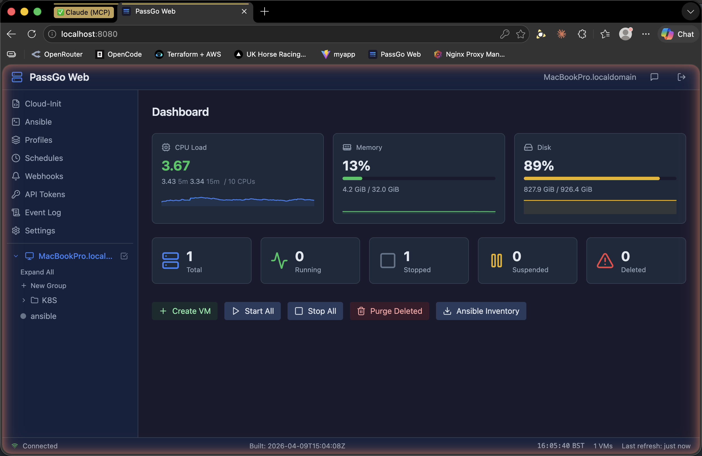
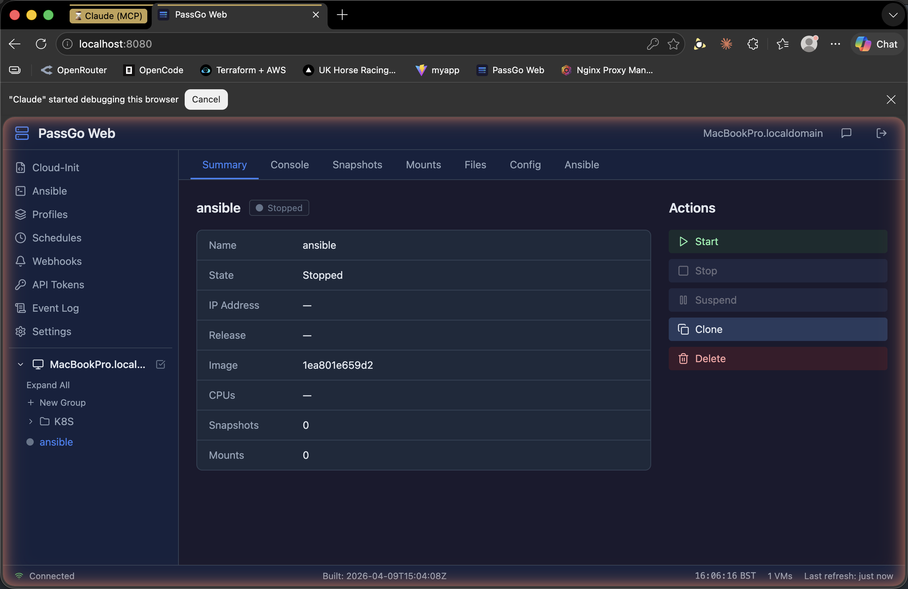
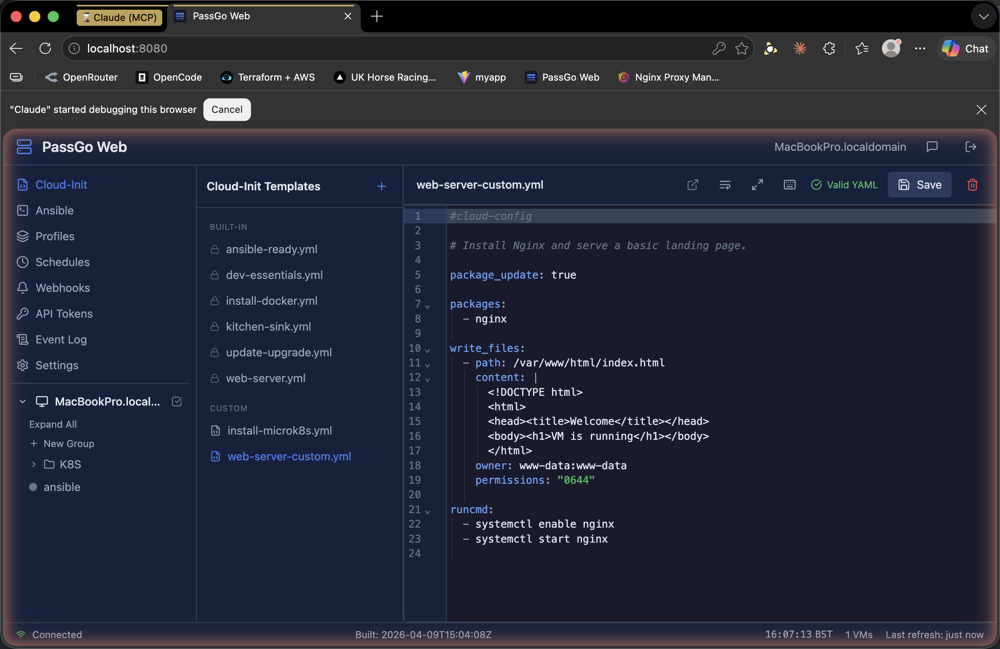
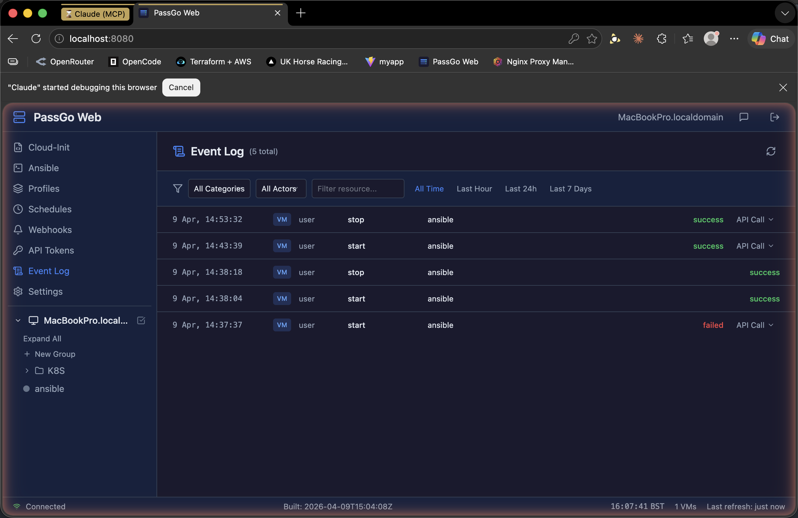

# PassGo Web

A web-based management interface for [Canonical Multipass](https://multipass.run/). Runs on the same machine as Multipass and provides a browser UI and REST API for managing virtual machines.

Modelled on the Proxmox/vSphere UI pattern: a tree sidebar for navigation, tabbed detail views, and a dashboard overview. Ships as a single binary with the frontend embedded — no separate web server or database required.



## Features

### VM Management
- **Create, start, stop, suspend, delete, and recover** instances from the browser
- **Clone** VMs (including from specific snapshots)
- **Resize** CPU, memory, and disk on existing VMs
- **Multi-select** VMs in the sidebar for bulk start/stop/delete operations
- **Async launch** — VM creation runs in the background with live progress tracking

### Dashboard & Monitoring
- **Host resource cards** showing CPU load, memory usage, and disk with sparkline history graphs
- **VM status counts** — total, running, stopped, suspended, deleted at a glance
- **Bulk actions** — Start All, Stop All, Purge Deleted, and Ansible Inventory download

### Web Terminal
- **Browser-based shell** access to VMs via xterm.js and WebSocket
- **Persistent PTY sessions** — shell processes survive page refreshes and reconnects with 64KB scrollback replay
- **Multi-tab terminals** — open multiple independent shell sessions per VM



### Cloud-Init Templates
- **Built-in templates** for common setups (Docker, web server, dev essentials, etc.)
- **Custom templates** with full CRUD — create, edit, and delete your own
- **CodeMirror 6 YAML editor** with syntax highlighting, real-time validation, cloud-init key autocomplete, search (Ctrl+F), fullscreen mode, indent guides, and word wrap toggle
- Select templates when creating VMs to provision them automatically



### Ansible Integration
- **Playbook management** — create, edit, and store Ansible playbooks in the browser
- **Run playbooks** against VMs with target picker and SSE-streamed terminal output
- **Inventory generation** — export Ansible inventory YAML for your Multipass VMs
- **Auto-run queue** — attach playbooks to launch profiles so they run automatically after VM creation

### Launch Profiles
- **Save VM configurations** as reusable profiles (release, CPUs, memory, disk, cloud-init template, network, playbook, group assignment)
- **One-click launch** from saved profiles in the Create VM dialog
- **Save-as-profile** option when creating a VM to capture settings for reuse

### Scheduled Operations
- **Time-based automation** — schedule VM start/stop or playbook runs at specific times and days of the week
- **Execution history** — view the last 50 schedule runs with status

### VM Groups
- **Folder-based organization** — group VMs into collapsible folders in the sidebar tree
- **Group actions** — start, stop, or delete all VMs in a group from the context menu
- **Drag-and-drop assignment** — move VMs between groups

### File Transfer
- **Browser-based file browser** for navigating VM filesystems
- **Upload and download** files between host and VM

### Snapshots & Mounts
- **Create, restore, and delete** VM snapshots
- **Clone from snapshot** to create a new VM from a point-in-time state
- **Manage shared folders** between host and VMs

### AI Chat Assistant
- **LLM-powered management** — manage VMs using natural language through a built-in chat panel
- **Works with any OpenAI-compatible API** (OpenRouter, Ollama, etc.)
- **Tool-calling agent** with 24 tools covering VM operations, cloud-init, groups, and more
- **Safety controls** — destructive operations require explicit confirmation; read-only mode available
- **SSE streaming** with markdown rendering

### API & Automation
- **REST API** covering all VM, snapshot, mount, cloud-init, ansible, profile, schedule, and config operations
- **API tokens** — create persistent Bearer tokens for external automation (Postman collection included)
- **Webhooks** — receive HTTP POST notifications when events occur, with category/result filtering and optional HMAC-SHA256 signing
- **Config export/import** — back up and restore your settings, templates, and playbooks as a single JSON file

### Audit & Observability
- **Event log** — persistent audit trail of all state-changing operations with filtering by category, actor, resource, and time range
- **API call details** — expandable view of the underlying API call for each event



## Quick Start

Download the latest binary from [Releases](https://github.com/rootisgod/passgo-webui/releases), then:

```bash
chmod +x passgo-web-linux-amd64
./passgo-web-linux-amd64
```

The server starts on `http://localhost:8080`. Default login is `admin` / `admin`. A config file is created at `~/.passgo-web/config.json` on first run.

### Options

```
-port 9090      Listen on a specific port (overrides config)
-config path    Use a custom config file path
-version        Print version and exit
```

## Building from Source

Requires Go 1.22+ and Node.js 20+.

```bash
# Build frontend
cd frontend && npm ci && npm run build && cd ..

# Copy frontend assets for embedding
mkdir -p cmd/server/frontend
cp -r frontend/dist cmd/server/frontend/dist

# Build binary
go build -o passgo-web ./cmd/server/
```

## Configuration

Config lives at `~/.passgo-web/config.json`. Key settings:

| Setting | Description |
|---------|-------------|
| `listen` | Address and port (default `:8080`) |
| `cloud_init_dir` | Directory for custom cloud-init templates |
| `trust_proxy` | Trust `X-Forwarded-For` headers when behind a reverse proxy |
| `llm` | LLM chat config: `base_url`, `api_key`, `model`, `read_only` |
| `profiles` | Saved launch profiles |
| `schedules` | Scheduled operations |
| `webhooks` | Webhook notification endpoints |
| `api_tokens` | Hashed API tokens for external automation |
| `groups` / `vm_groups` | VM group definitions and assignments |

User cloud-init templates (`.yml` files starting with `#cloud-config`) placed in the `cloud_init_dir` directory will appear in the template picker when creating VMs.

## API

All endpoints require authentication via session cookie or `Authorization: Bearer <token>` header. Endpoints are under `/api/v1/`:

<details>
<summary>Full API reference</summary>

| Endpoint | Method | Description |
|----------|--------|-------------|
| **Auth** | | |
| `/auth/login` | POST | Log in |
| `/auth/logout` | POST | Log out |
| `/version` | GET | Server version |
| **VMs** | | |
| `/vms` | GET | List all VMs |
| `/vms` | POST | Create a VM |
| `/vms/{name}` | GET | VM details |
| `/vms/{name}` | DELETE | Delete a VM |
| `/vms/{name}/start` | POST | Start |
| `/vms/{name}/stop` | POST | Stop |
| `/vms/{name}/suspend` | POST | Suspend |
| `/vms/{name}/recover` | POST | Recover deleted VM |
| `/vms/{name}/clone` | POST | Clone |
| `/vms/{name}/exec` | POST | Execute command |
| `/vms/{name}/config` | GET/PUT | Read/resize CPU, memory, disk |
| `/vms/{name}/cloud-init/status` | GET | Cloud-init status |
| `/vms/start-all` | POST | Start all VMs |
| `/vms/stop-all` | POST | Stop all VMs |
| `/vms/purge` | POST | Purge deleted VMs |
| **Snapshots** | | |
| `/vms/{name}/snapshots` | GET/POST | List/create snapshots |
| `/vms/{name}/snapshots/{snap}/restore` | POST | Restore snapshot |
| `/vms/{name}/snapshots/{snap}` | DELETE | Delete snapshot |
| **Mounts** | | |
| `/vms/{name}/mounts` | GET/POST/DELETE | Manage mounts |
| **Shell** | | |
| `/vms/{name}/shell/sessions` | GET/POST | List/create shell sessions |
| `/vms/{name}/shell/sessions/{id}` | DELETE | Delete session |
| `/vms/{name}/shell/{id}` | WebSocket | Interactive shell |
| **Cloud-Init** | | |
| `/cloud-init/templates` | GET | List all templates |
| `/cloud-init/templates/{name}` | GET/POST/PUT/DELETE | Template CRUD |
| **Ansible** | | |
| `/ansible/playbooks/{name}` | GET/POST/PUT/DELETE | Playbook CRUD |
| `/ansible/run` | POST | Run playbook (SSE stream) |
| `/ansible/inventory` | GET | Generate inventory YAML |
| `/ansible/status` | GET | Check ansible-playbook installed |
| `/ansible/run/queue` | GET/DELETE | Auto-run queue |
| **Groups** | | |
| `/groups` | GET/POST | List/create groups |
| `/groups/{name}` | PUT/DELETE | Rename/delete group |
| `/groups/assign` | PUT | Assign VM to group |
| `/groups/reorder` | PUT | Reorder groups |
| **Profiles** | | |
| `/profiles` | GET/POST | List/create profiles |
| `/profiles/{id}` | PUT/DELETE | Update/delete profile |
| **Schedules** | | |
| `/schedules` | GET/POST | List/create schedules |
| `/schedules/{id}` | PUT/DELETE | Update/delete schedule |
| `/schedules/history` | GET | Recent execution history |
| **Tokens** | | |
| `/tokens` | GET/POST | List/create API tokens |
| `/tokens/{id}` | DELETE | Revoke token |
| **Webhooks** | | |
| `/webhooks` | GET/POST | List/create webhooks |
| `/webhooks/{id}` | PUT/DELETE | Update/delete webhook |
| `/webhooks/{id}/test` | POST | Send test event |
| **Events** | | |
| `/events` | GET | Query event log (filters: category, actor, resource, since, before, limit) |
| **Chat** | | |
| `/chat` | POST | LLM chat (SSE stream) |
| `/chat/config` | GET/PUT | LLM configuration |
| `/chat/models` | GET | List available models |
| **Config** | | |
| `/config/export` | GET | Export settings + templates + playbooks |
| `/config/import` | POST | Import from exported bundle |
| **Other** | | |
| `/host/resources` | GET | Host CPU/RAM info |
| `/networks` | GET | Available networks |
| `/launches` | GET | In-progress launches |
| `/launches/{name}` | DELETE | Dismiss launch |

</details>

A downloadable Postman collection is available from the API Tokens tab in the UI.

## Running as a Service (Ubuntu/systemd)

On Ubuntu, you can run PassGo Web as a systemd service so it starts automatically on boot. The service runs as root because Multipass requires root-level access to its daemon socket.

### 1. Install the binary

```bash
sudo cp passgo-web-linux-amd64 /usr/local/bin/passgo-web
sudo chmod +x /usr/local/bin/passgo-web
```

### 2. Create the systemd unit

```bash
sudo tee /etc/systemd/system/passgo-web.service > /dev/null <<'EOF'
[Unit]
Description=PassGo Web - Multipass Management UI
After=network.target snap.multipass.multipassd.service
Wants=snap.multipass.multipassd.service

[Service]
Type=simple
Environment=HOME=/root
ExecStart=/usr/local/bin/passgo-web
Restart=on-failure
RestartSec=5

[Install]
WantedBy=multi-user.target
EOF
```

### 3. Enable and start

```bash
sudo systemctl daemon-reload
sudo systemctl enable passgo-web
sudo systemctl start passgo-web
```

### 4. Check status and logs

```bash
systemctl status passgo-web
journalctl -u passgo-web -f
```

The UI will be available at `http://<your-server>:8080`. Config is created at `/root/.passgo-web/config.json` on first run.

### Uninstall

```bash
sudo systemctl stop passgo-web
sudo systemctl disable passgo-web
sudo rm /etc/systemd/system/passgo-web.service
sudo rm /usr/local/bin/passgo-web
sudo systemctl daemon-reload
```

### Using Task

If you have [Task](https://taskfile.dev/) installed and have built from source:

```bash
sudo task service-install    # build, install binary, enable and start
sudo task service-remove     # stop, disable, remove everything
sudo task service-restart    # restart after deploying a new build
task service-status          # show service status
task service-logs            # follow live logs
```

## Security

- Password authentication with bcrypt hashing (plaintext passwords auto-migrated on startup)
- Session-based auth for the browser UI, Bearer token auth for API access
- Login rate limiting (5/min) and API rate limiting (30/min on chat and VM creation)
- CSP security headers
- `trust_proxy` config flag to control `X-Forwarded-For` header trust
- File transfer paths validated against directory traversal
- PTY session IDs use crypto/rand
- Config export strips passwords and API keys

## Tech Stack

- **Backend:** Go with embedded frontend (`go:embed`), single binary
- **Frontend:** Vue 3 + Vite + Tailwind CSS + Pinia
- **Terminal:** xterm.js over WebSocket with persistent PTY sessions
- **Editor:** CodeMirror 6 with YAML syntax, linting, and autocomplete
- **Icons:** Lucide

## License

MIT
