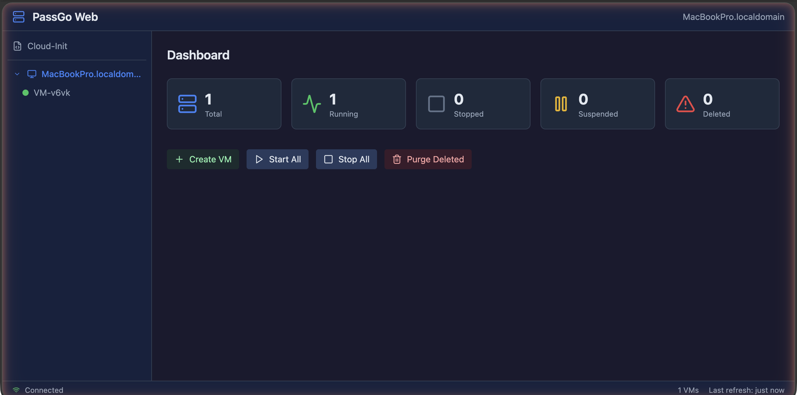

# PassGo Web

A web-based management interface for [Canonical Multipass](https://multipass.run/). Runs on the same machine as Multipass and provides a browser UI and REST API for managing virtual machines.

Modelled on the Proxmox/vSphere UI pattern: a tree sidebar for navigation, tabbed detail views, and a dashboard overview.



## Features

- **Dashboard** with VM status counts and bulk actions (Start All, Stop All, Purge)
- **VM Management** — create, start, stop, suspend, delete, and recover instances
- **Web Terminal** — browser-based shell access to VMs via xterm.js and WebSocket
- **Snapshots** — create, restore, and delete VM snapshots
- **Mounts** — manage shared folders between host and VMs
- **Cloud-Init Templates** — built-in and user-defined templates with a YAML editor (CodeMirror)
- **Async VM Launch** — launches run in the background with progress tracking
- **REST API** — all actions available via API for external automation

## Quick Start

Download the latest binary from [Releases](https://github.com/rootisgod/passgo-webui/releases), then:

```bash
chmod +x passgo-web-linux-amd64
./passgo-web-linux-amd64
```

The server starts on `http://localhost:8080`. A config file is created at `~/.passgo-web/config.json` on first run.

### Options

```
-port 9090      Listen on a specific port (overrides config)
-config path    Use a custom config file path
-version        Print version and exit
```

## Building from Source

Requires Go 1.25+ and Node.js 20+.

```bash
# Build frontend
cd frontend && npm ci && npm run build && cd ..

# Copy frontend assets for embedding
mkdir -p cmd/server/frontend
cp -r frontend/dist cmd/server/frontend/dist

# Build binary
go build -o passgo-web ./cmd/server/
```

## Configuration

Config lives at `~/.passgo-web/config.json`:

```json
{
  "listen": ":8080",
  "cloud_init_dir": "~/.passgo-web/cloud-init"
}
```

User cloud-init templates (`.yml` files starting with `#cloud-config`) placed in the `cloud_init_dir` directory will appear in the template picker when creating VMs.

## API

All endpoints are under `/api/v1/`:

| Endpoint | Method | Description |
|----------|--------|-------------|
| `/version` | GET | Server version info |
| `/vms` | GET | List all VMs |
| `/vms` | POST | Create a VM |
| `/vms/{name}` | GET | Get VM details |
| `/vms/{name}` | DELETE | Delete a VM |
| `/vms/{name}/start` | POST | Start a VM |
| `/vms/{name}/stop` | POST | Stop a VM |
| `/vms/{name}/suspend` | POST | Suspend a VM |
| `/vms/{name}/recover` | POST | Recover a deleted VM |
| `/vms/{name}/exec` | POST | Execute a command in a VM |
| `/vms/{name}/shell` | WebSocket | Interactive shell |
| `/vms/{name}/snapshots` | GET/POST | List/create snapshots |
| `/vms/{name}/mounts` | GET/POST/DELETE | Manage mounts |
| `/vms/start-all` | POST | Start all VMs |
| `/vms/stop-all` | POST | Stop all VMs |
| `/vms/purge` | POST | Purge deleted VMs |
| `/cloud-init/templates` | GET/POST | List/create templates |
| `/networks` | GET | List available networks |

## Tech Stack

- **Backend:** Go with embedded frontend (`go:embed`), single binary
- **Frontend:** Vue 3 + Vite + Tailwind CSS + Pinia
- **Terminal:** xterm.js over WebSocket with PTY
- **Editor:** CodeMirror 6 with YAML syntax and linting

## License

MIT
